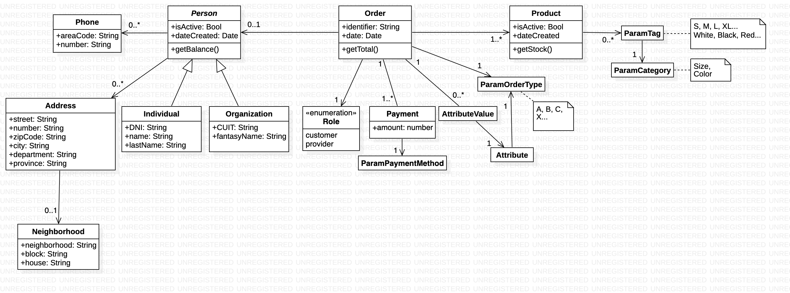

Just a simple inventory management API.

You need pre installed mongo, node 8+ and yarn (package manager).

For debian based distros:
```sh
apt update
apt install mongo node
npm i yarn --g
```

For macOS, assuming you have homebrew installed:
```sh
brew install mongo node
npm i yarn --g
```

Install dependencies:
```sh
yarn
```

Compile:
```sh
tsc
```

Run it:
```sh
yarn start
```

You can then access it through a [web browser](localhost:3000/api).
```sh
localhost:3000/api
```

Planned classes:

*This is a draft version, and classes names are likely to be renamed.*


